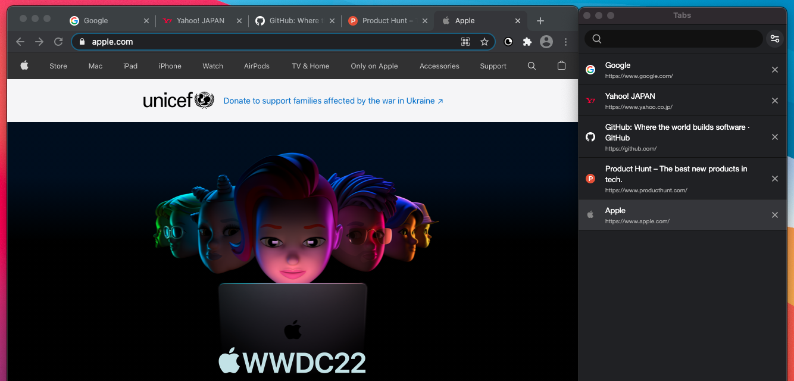
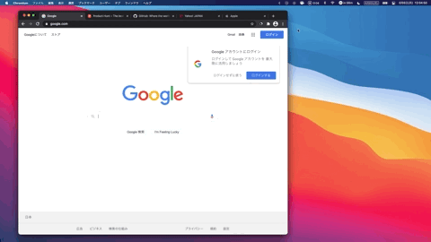

# Tabs

Experimental tab manager extension for Chrome. 
Aimed to improve UX for tab management and archive better overview of tabs information.

## Features

- Vertical layout
- Preview on hover
- Grid layout window overview
- Drag and drop sorting
- Multiple window support

## Usage

Hover to preview tabs. 

Click on [x] to close tabs. 

Multiple windows support. 

Grid (or column) layout for multiple windows overview. 

